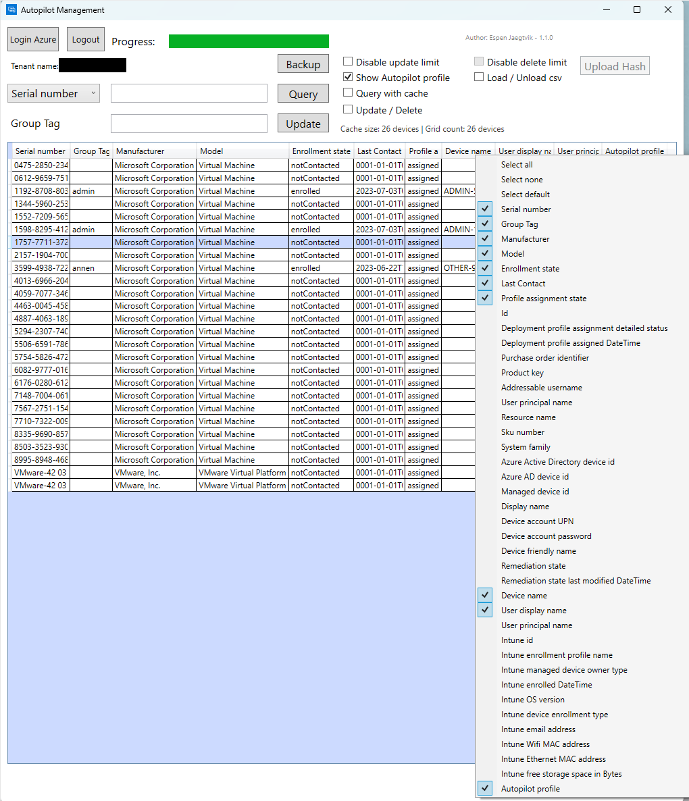
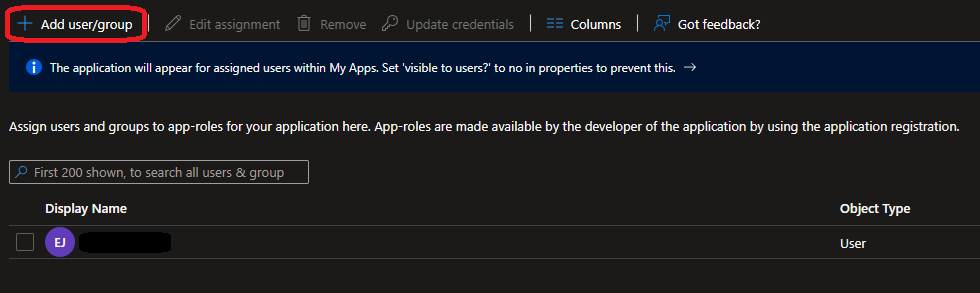
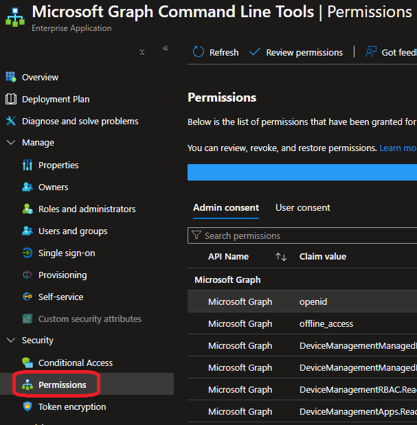
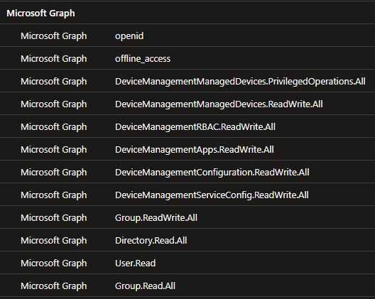

# About

Created by: Espen Jaegtvik

Date: 07.05.2024

Version: 1.1.2

Info: Only .exe file is needed to run, however you may use source code
(ps1) instead. The difference is .exe file do not require admin nor
executionpolicy to be set, also runs process more smoothly
(multiprocess).

# Purpose

Simplify the day for an Intune admin. Easily manage Autopilot devices.

-   Search for Autopilot devices

    -   Device name (Intune)

    -   Serial number (Autopilot)

    -   Any Autopilot-object property

-   Update / bulk update Group Tags

-   Delete / bulk delete devices from Autopilot, Intune and Azure AD

-   Sort the table

-   Upload Autopilot hardware hashes

-   Query if devices are already uploaded using csv files (e.g. hardware
    hash file)

# Features

For full experience, authenticate with a Global administrator or an
Intune administrator.

<table>
<colgroup>
<col style="width: 21%" />
<col style="width: 45%" />
<col style="width: 33%" />
</colgroup>
<thead>
<tr class="header">
<th>Function</th>
<th>Description</th>
<th>Examples / additional info</th>
</tr>
</thead>
<tbody>
<tr class="odd">
<td>Login Azure</td>
<td>
Authenticate to Azure. Supports MFA. Uses the Enterprise App “Microsoft Graph Command Line Tools” for queries to Graph. Therefore you might be asked to consent to the app.

Authenticated token will automatically refresh.
</td>
<td></td>
</tr>
<tr class="even">
<td>Logout</td>
<td>Activates after logging in. Logs the user out and stops the refresh token process. Disables the UI.</td>
<td>Prompts for logout confirmation when theres an active job detected.</td>
</tr>
<tr class="odd">
<td>
Dropdown box

<ul>
<li>
Serial number
</li>
<li>
Device name
</li>
<li>
Any
</li>
</ul></td>
<td>
Choose what to search for.

“Serial number” is fastest for query and will check only serial number associated with Autopilot object.

“Device name” will make an extra query towards Intune-object associated with Autopilot-object.

“Any” will search all properties of Autopilot-object.
</td>
<td></td>
</tr>
<tr class="even">
<td>Query textbox</td>
<td>Input what to search for.</td>
<td>
Device with serial number “PF98445”.

There are multiple ways to find this device. Examples to match it, search the following:

- PF

- 9

- PF?8445

- PF*45

? = any character

* = any character between
</td>
</tr>
<tr class="odd">
<td>Query</td>
<td>Start search. Textbox can be blank. Will then return all devices.</td>
<td>Blank search on device name and serial number will return same result.</td>
</tr>
<tr class="even">
<td>Group Tag, textbox</td>
<td>Set your Group tag to update device with</td>
<td>Ex. Group Tag “Admin”, must select both device from table and click “Update” to initiate.</td>
</tr>
<tr class="odd">
<td>Update / Delete, button</td>
<td>
Button changes between Update / Delete when checkbox “Update / Delete” is checked.

Update:

Must select one or several devices. Will update selected devices’ Group tag with what you defined in textbox.

Delete:

Delete selected Autopilot object. Keep in mind this will permanently delete the device from Autopilot and Intune (if you choose to). THEREFORE BE CAREFUL
</td>
<td>
Update:

Textbox for Group Tag can be blank, will then wipe existing Group tag from device.

Delete:

Limited to single device unless box “Disable delete limit” is checked. Will prompt for confirmation if Intune object exist.
</td>
</tr>
<tr class="even">
<td>Backup</td>
<td>
Backup selected devices to %LOCALAPPDATA%\AutopilotManagement

<strong>THIS IS NOT A HARDWARE HASH BACKUP.</strong>
</td>
<td>Makes a csv-file with all values shown (+ some more).</td>
</tr>
<tr class="odd">
<td>Disable update limit</td>
<td>
Only works when “Update / Delete” checkbox is unchecked.

To avoid ctrl + a (all devices selected), and wiping existing Group tag info, you must check this box to be able to edit more than five devices at once.

This is to avoid Ctrl + A and accidentally changing Group Tag of all devices.
</td>
<td>
If unselected:

Selecting 5 (or more) devices in table and clicking “Update” will prompt a message stopping execution.
</td>
</tr>
<tr class="even">
<td>Show Autopilot profile</td>
<td>Check to add extra information to query. Query will take a long time in large environment, warning displayed when trying to query a 200+ device environment, asking if you want to disable Autopilot profile search.</td>
<td></td>
</tr>
<tr class="odd">
<td>Query with cache</td>
<td>Recommended to use in large environments. Will save last query, which can then be reused with searches.</td>
<td>
Initiate a query. Cache size and “Query with cache” will be enabled.

Check the box and you can search device name or serial number within the saved cache.
</td>
</tr>
<tr class="even">
<td>Update / Delete</td>
<td>Changes between option to update or delete a device.</td>
<td></td>
</tr>
<tr class="odd">
<td>Disable delete limit</td>
<td>Allow deleting multiple Autopilot objects. You will be warned if you attempt to delete an Intune device, as this is unrecoverable. You will also need the Autopilot hardware hash to readd device to Autopilot.</td>
<td>Catastrophic consequence if all is selected, then deleted.</td>
</tr>
<tr class="even">
<td>Load / Unload csv</td>
<td>Allows you to search a csv-file if csv has column with name “Device Serial Number”. Will list devices found in csv and report on those not found.</td>
<td>Can also be an actual Autopilot hardware hash csv-file.</td>
</tr>
<tr class="odd">
<td>Upload Hash</td>
<td>
Upload hardware hash. Must be a valid hardware hash file for it to be enabled.

Report is launched when import is complete.

Supports multiple uploads/imports. Initiate one file at the time.
</td>
<td></td>
</tr>
<tr class="even">
<td>Context menu (right click)</td>
<td>Right click anywhere in the data grid and you can toggle columns to get desired information.</td>
<td></td>
</tr>
</tbody>
</table>

# To do

-   Optimize queries

    -   Run in background

-   Add logging option for troubleshooting / errors

-   Check if authenticated user has required permissions

# Troubleshooting

You will be able to authenticate with any user, however
you will get an error when trying to modify a device.

It is therefore recommended to run with either:

-   Global administrator

-   Intune administrator (least privilege)

## Trouble signing you in

<table>
<colgroup>
<col style="width: 100%" />
</colgroup>
<thead>
<tr class="header">
<th>
Your organization has also blocked ordinary users from accessing this or all Enterprise applications.

Instead log in with a user that has admin rights. Preferably Global admin or Intune admin.
</th>
</tr>
</thead>
<tbody>
<tr class="odd">
<td></td>
</tr>
</tbody>
</table>

## Enterprise app – Consent

<table>
<colgroup>
<col style="width: 100%" />
</colgroup>
<thead>
<tr class="header">
<th>
Consent to the app Microsoft Graph Command Line Tools.

Must be done by Global admin, Application admin or Cloud application admin.

<strong>To allow other admins to use tool (with less/other privileges, ex. Intune admin): make sure you select "Consent on behalf of your organization".</strong>
</th>
</tr>
</thead>
<tbody>
<tr class="odd">
<td></td>
</tr>
</tbody>
</table>

<table>
<colgroup>
<col style="width: 100%" />
</colgroup>
<thead>
<tr class="header">
<th>
Alternatively you can adminconsent to the Enterprise app using PowerShell, see detailed description by Microsoft here:

<a href="https://learn.microsoft.com/en-us/entra/identity/enterprise-apps/grant-consent-single-user?pivots=msgraph-powershell">https://learn.microsoft.com/en-us/entra/identity/enterprise-apps/grant-consent-single-user?pivots=msgraph-powershell</a>

Do so with Global admin, Application admin or Cloud application admin. Make sure you add these permissions as part of the script:
</th>
</tr>
</thead>
<tbody>
<tr class="odd">
<td></td>
</tr>
</tbody>
</table>

<table>
<colgroup>
<col style="width: 100%" />
</colgroup>
<thead>
<tr class="header">
<th>
If you for some reason:

<ul>
<li>
Can’t login and don’t get the consent prompt
</li>
<li>
Forgot to consent on behalf of organization
</li>
<li>
Anything else
</li>
</ul>

Error from app:
</th>
</tr>
</thead>
<tbody>
<tr class="odd">
<td></td>
</tr>
</tbody>
</table>

## Enterprise app – Properties

<table>
<colgroup>
<col style="width: 100%" />
</colgroup>
<thead>
<tr class="header">
<th>
Verify the following properties in the Enterprise app.

Go to: <a href="https://portal.azure.com">https://portal.azure.com</a> -&gt; Search "Enterprise applications"

If you see the app “Microsoft Graph Command Line Tools” in the application list, it means you or someone else has already consented to it. Click it.

(If you don’t see it, go to chapter "Enterprise app - Consent").
</th>
</tr>
</thead>
<tbody>
<tr class="odd">
<td></td>
</tr>
</tbody>
</table>

| If it’s in the list and permissions seem ok, check if users are allowed to sign-in to the Enterprise app. “Enabled for users to sign-in” should be set to “Yes”. At the same time, if “Assignment required” is set to “Yes”, then you need to add your user under “Users and groups”. |
|---------------------------------------------------------------------------------------------------------------------------------------------------------------------------------------------------------------------------------------------------------------------------------------|
|                                                                                                                                               |
| Make sure your user is added here.                                                                                                                                                                                                                                                    |
|                                                                                                                                                                                                                      |

## Enterprise app - Verify permissions

| Go to permissions.                                                                                                                                                                 |
|------------------------------------------------------------------------------------------------------------------------------------------------------------------------------------|
|                                                                                                             |
| It should look like this. Keep in mind the last two permissions might look a bit different for you (User.Read and Group.Read.All), this is fine, it is still the same permissions. |
|                                                                                                                |

## Can’t run exe-file

Since exe-file is not signed or known by Microsoft, it will be stopped
by Attack surface reduction rule “Block executable files from running
unless they meet a prevalence, age, or trusted list criterion”. To
bypass this you need local administrator and access to Powershell. PS:
for security reasons don’t make an exclusion on all production machines,
only computer you need to execute application from.

Run the following in Powershell (as admin):

Add-MpPreference -AttackSurfaceReductionOnlyExclusions “\<path to file>”

For the above to work, Defender tampering can not be active.
